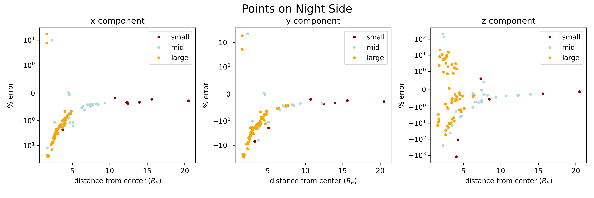

# Analytic Demostration
Using the same set of randomly generated points as before, the following quantities were calculated and recorded:
- B_biotsavart : the magnetic field calculated via biot savart using an analytic form of J that decays as $r^{-5}$
- B_analytic : the magnetic field from the analytic form of the exact solution with the above J

The points on the Day and Night side were plotted seperately in two different figures. The plots show percent error vs distance from Earth center. The percent error of each cartesian component is calculated with:
- the corresponding component of B_analytic used as the "expected value"
- The corresponding component of B_biotsavart used as the "observed value"

All distances are in Earth radii, all magnetic fields are in nanoTesla.

## Nightside

>3 scatterplots, one for each cartesian component. One dot for each sampled gridpoint on the nightside.
>
>datapoints color coded based on the absolute value of the corresponding component of *B_analytic* (or *value*)
>
>small includes only points with *value* < 100 nT.
>mid includes only points with 100 nT <= *value* <= 1000 nT.
>large includes only points with 1000 nT <= *value*.

## Dayside

>3 scatterplots, one for each cartesian component. One dot for each sampled gridpoint on the nightside.
>
>datapoints color coded based on the absolute value of the corresponding component of *B_analytic* (or *value*)
>
>small includes only points with *value* < 100 nT.
>mid includes only points with 100 nT <= *value* <= 1000 nT.
>large includes only points with 1000 nT <= *value*.

## Summary of Results and Conclusion

