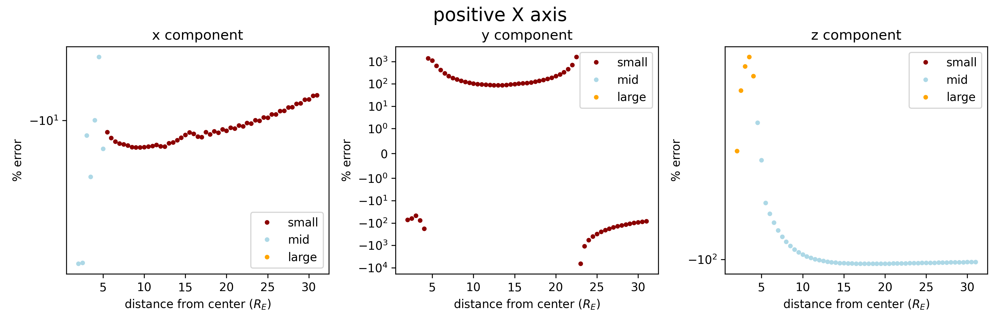
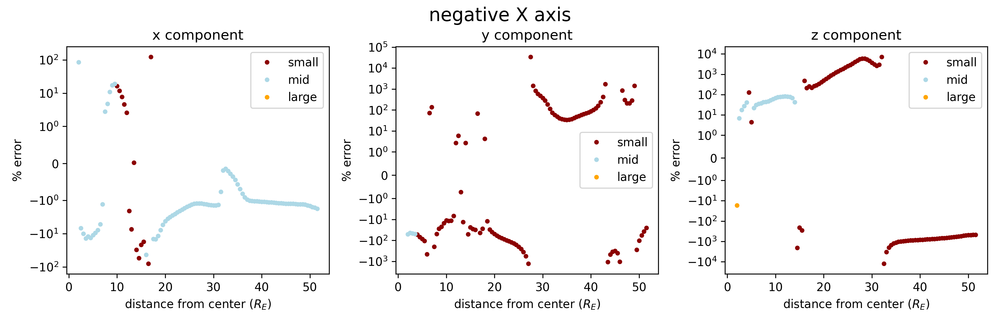
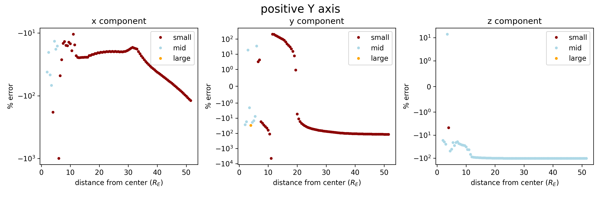
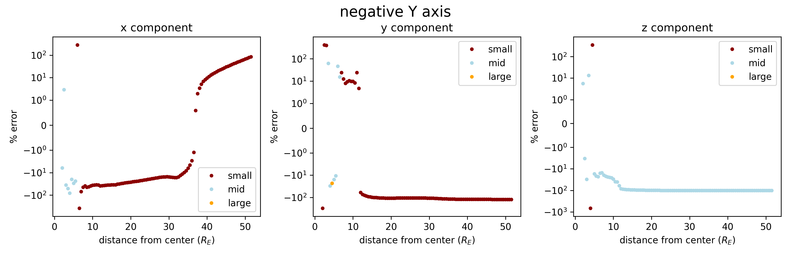

# axes_bs_mhd_comparison
The following quantities were calculated along various axes in the GSM x-y plane:
- B_biotsavart : the magnetic field calculated via biot savart using an analytic form of J that decays as $r^{-5}$
- B_analytic : the magnetic field from the analytic form of the exact solution with the above J

There are plots for each axis seperately. The plots show percent error vs distance from Earth center. The percent error of each cartesian component is calculated with:
- the corresponding component of B1_simulation used as the "expected value"
- The corresponding component of B_biotsavart used as the "observed value"

All distances are in Earth radii, all magnetic fields are in nanoTesla.

## positive X axis

>3 scatterplots, one for each cartesian component. One dot for each sampled gridpoint on the nightside.
>
>datapoints color coded based on the absolute value of the corresponding component of *B1_simulation* (or *value*)
>
>small includes only points with *value* < 100 nT.
>mid includes only points with 100 nT <= *value* <= 1000 nT.
>large includes only points with 1000 nT <= *value*.

## negative X axis

>3 scatterplots, one for each cartesian component. One dot for each sampled gridpoint on the nightside.
>
>datapoints color coded based on the absolute value of the corresponding component of *B1_simulation* (or *value*)
>
>small includes only points with *value* < 100 nT.
>mid includes only points with 100 nT <= *value* <= 1000 nT.
>large includes only points with 1000 nT <= *value*.

## positive Y axis

>3 scatterplots, one for each cartesian component. One dot for each sampled gridpoint on the nightside.
>
>datapoints color coded based on the absolute value of the corresponding component of *B1_simulation* (or *value*)
>
>small includes only points with *value* < 100 nT.
>mid includes only points with 100 nT <= *value* <= 1000 nT.
>large includes only points with 1000 nT <= *value*.

## negative Y axis

>3 scatterplots, one for each cartesian component. One dot for each sampled gridpoint on the nightside.
>
>datapoints color coded based on the absolute value of the corresponding component of *B1_simulation* (or *value*)
>
>small includes only points with *value* < 100 nT.
>mid includes only points with 100 nT <= *value* <= 1000 nT.
>large includes only points with 1000 nT <= *value*.
