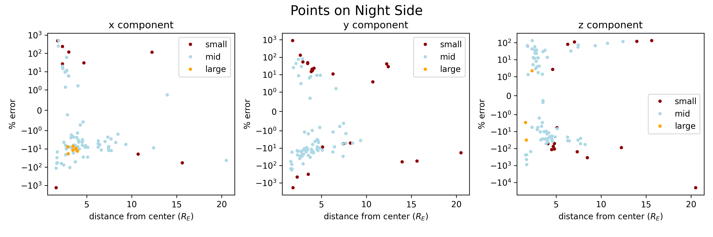
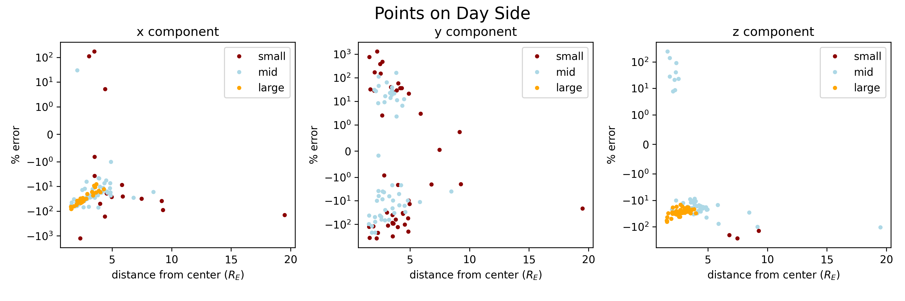

# Biot-Savart and MhD Comparison

a sequence of points was sampled at random from the native BATS-R-US grid. At each of these points, the following quantities were calculated and recorded: 
- *B1_simulation* : the MhD magnetic field excluding the earth dipole field (i.e. "b1" in BATS-R-US)
- *B_biotsavart* : the magnetic field calculated due to the MhD current density ("j" in BATS-R-US)

The points on the Day and Night side were plotted seperately in two different figures. The plots show percent error vs distance from earth center. The percent error of each cartesian component is calculated with: 
- the corresponding component of *B1_simulation*  --  Treated as the "expected value"
- the corresponding component of *B_biotsavart*  --  Treated as the "observed value"

All distances are in earth radii, all magnetic fields are in nanoTesla.

## Nightside
 
>3 scatterplots, one for each cartesian component. One dot for each sampled gridpoint on the nightside.
>
>datapoints color coded based on the absolute value of the corresponding component of *B1_simulation* (or *value*)
>
>small includes only points with *value* < 100 nT.
>mid includes only points with 100 nT <= *value* <= 1000 nT.
>large includes only points with 1000 nT <= *value*.

## Dayside
 
>3 scatterplots, one for each cartesian component. One dot for each sampled gridpoint on the dayside.
>
>datapoints color coded based on the absolute value of the corresponding component of *B1_simulation* (or *value*)
>
>small includes only points with *value* < 100 nT.
>mid includes only points with 100 nT <= *value* <= 1000 nT.
>large includes only points with 1000 nT <= *value*.

Note: Points outside the MhD domain, because they are say too close to earth, have *B1_simulation* = 0. These are not included in the plots, as they would be +/- infinity.
