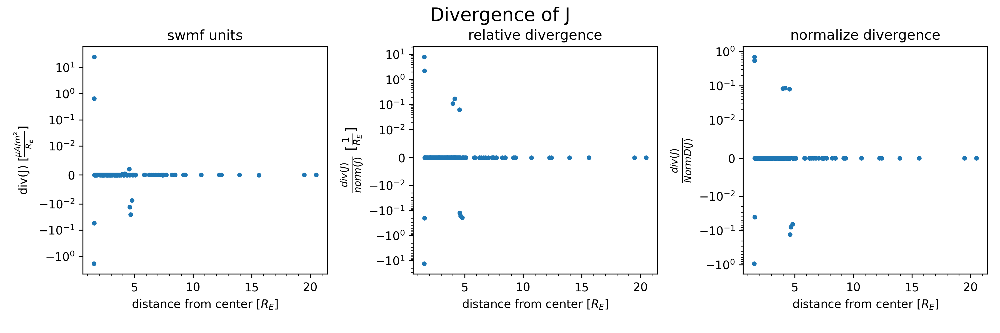
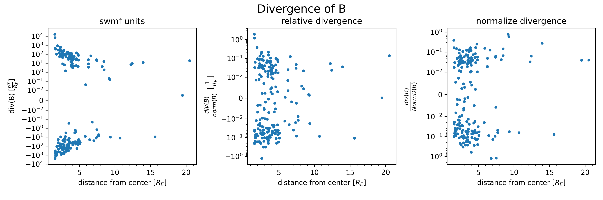

# Derivatives

The [total derivative](https://en.wikipedia.org/wiki/Total_derivative) of a vector field at a given point is a linear operator on the vectors at that point. This can be seen by arranging all the partial derivatives into [a matrix](https://en.wikipedia.org/wiki/Jacobian_matrix_and_determinant). An operator has a natural notion of "magnitude", given by the [operator norm](https://en.wikipedia.org/wiki/Operator_norm). In what follows, we will use 'NormD of F' as shorthand for the operator norm of the total derivative of F. Given a vector value function which in it's given units has a NormD well above machine precision, then other first derivative combinations (like divergence and curl) can be compared in a unit independent way to NormD. For example, if we have a field F where we want the divergence of F to be 0, then so long as NormD is well above machine precision, it makes sense to require div(F)/NormD(F)<<1.

For the SWMF output magnetic field and current field on the DIPTSUR2 run at 06:30, we will plot their divergence using the files original units for the field and R_E for the derivative. In addition, we will normalize it by using NormD and just the field itself.

The partial derivative were computed by symmetric difference, with a step size of 1/16. i.e. points for the difference quotient were taken to be +1/16 and -1/16 away from the given point along each coordinate axis, for a total interval of 1/8. 

## J (Current Field)

>for all three scatter plots, each data point is associated to a point in space on the native BATS-R-US grid (chosen at random), and the x-axis is the distance of that point from the center of the earth.
>
>the y-axis differs for the 3 plots:
>
> - div(J) in units of (muA/m^2)/R_E
> - div(J)/J in units of 1/R_E
> - div(J)/NormD(J) which is unitless

## B (Magnetic Field)

>for all three scatter plots, each data point is associated to a point in space on the native BATS-R-US grid (the same points as in the J case), and the x-axis is the distance of that point from the center of the earth.
>
>the y-axis differs for the 3 plots:
>
> - div(B) in units of nT/R_E
> - div(B)/B in units of 1/R_E
> - div(B)/NormD(B) which is unitless

