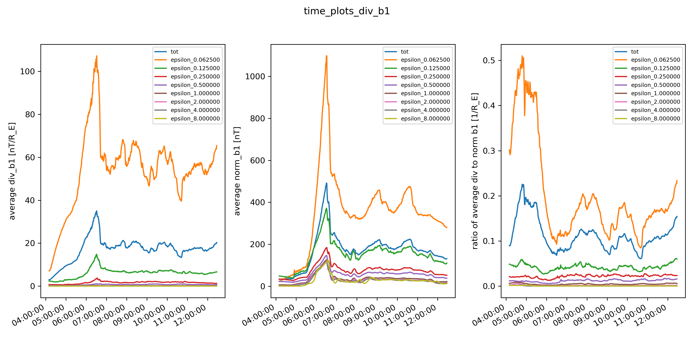
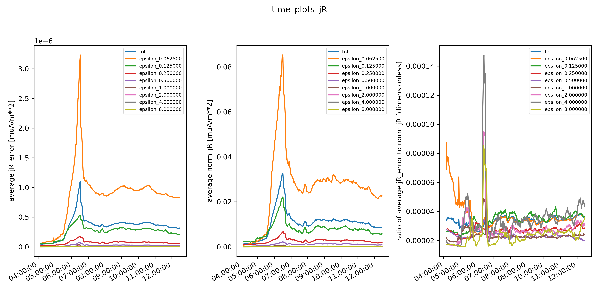

# DIPTSUR2 Timeseries

Quantities plotted as a function of time. The first 500 simulation output files are used.

The native grid points be can be derived from the leafs of the block tree. 
Each leaf corresponds to an 8x8x8 cartesian grid of points, and there are 11516 of them.
The native grid points are first rearanges into a 11516x8x8x8 array.
Quantities depending on first derivatives were calculated only at points not on block boundaries 
(i.e. there are $11516*6*6*6$ of them).

> x-axis displays the time in the simulation
> the legend shows which set of points were selected to derive the quantities from. Either the total available points, or only those in blocks with a certain grid resolution "epsilon".
> y-axis plots the 
> - "left" is the average of divergence of b1 over all the selected points
> - "center" is the average of norm (magnitude) of b1 over all the selected points
> - "right" is the ratio of "left" divided by "center"

> x-axis displays the time in the simulation
> the legend shows which set of points were selected to derive the quantities from. Either the total available points, or only those in blocks with a certain grid resolution "epsilon".
> y-axis plots the 
> - "left" is the average of the vector error in jR (norm of j-jR) over all the selected points
> - "center" is the average of norm (magnitude) of jR over all the selected points
> - "right" is the ratio of "left" divided by "center"
