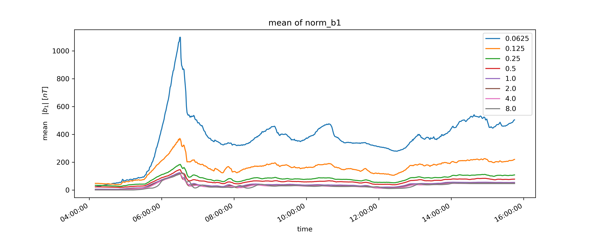
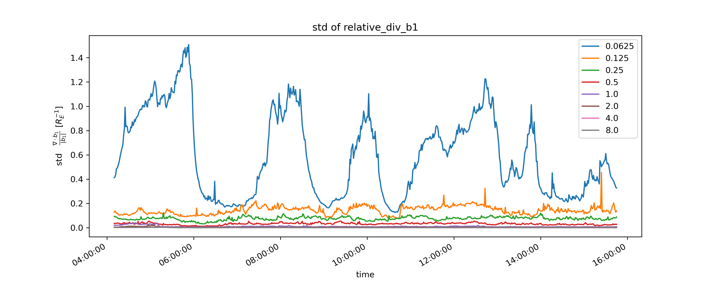
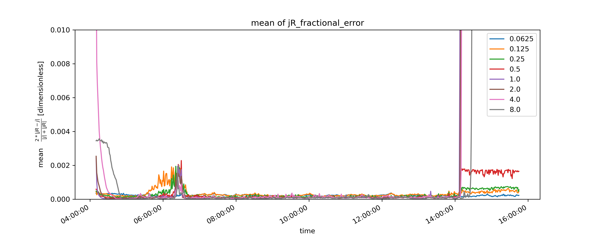

# DIPTSUR2 Timeseries

NOTE: what I was previously calling "average of divergence of b1" was actually
the average of the **absolute value** of the divergence.
Since the divergence is both positive and negative,
taking just the average will largely cancel out.
To remedy this potential confusion, and perhaps make more statistical sense,
this has been disregarded in favor of taking the standard deviation (std).

Quantities plotted as a function of time. All 698 simulation output files are used.

The native grid points be can be derived from the leafs of the block tree. 
Each leaf corresponds to an 8x8x8 cartesian grid of points, and there are 11516 of them.
The native grid points are first rearanges into a 11516x8x8x8 array.
Quantities depending on first derivatives were calculated only at points not on block boundaries 
(i.e. there are (11516)(6)(6)(6) of them).

> x-axis displays the time in the simulation.
>
> The legend indicated which set of points were selected to derive the quantities from.
> Namely, only those in blocks with the specified grid resolution.
>
> y-axis plots the 
> - "far top" is the standard deviation of divergence of b1 over all the selected points
> - "mid top" is the average of norm (magnitude) of b1 over all the selected points
> - "mid bottom" is the ratio of "far top" divided by "mid top"
> - "far bottom" is the standard deviation of the ratio of divergence b1 to magnitude b1 over all the selected points

> x-axis displays the time in the simulation.
>
> The legend indicated which set of points were selected to derive the quantities from.
> Namely, only those in blocks with the specified grid resolution.
>
> y-axis plots the 
> - "far top" is the average of the error in jR (norm of j-jR (nonnegative)) over all the selected points
> - "mid top" is the average of norm (magnitude) of j over all the selected points
> - "mid bottom" is the ratio of "far top" divided by "mid top"
> - "far bottom" is the average of the ratio of error in jR to magnitude j(R) over all the selected points

