# BATSRUS_derivatives_consistancyCheck.py DIPTSUR2 at 6:30

## checking divergences
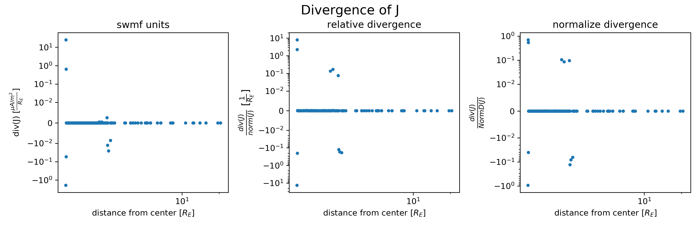
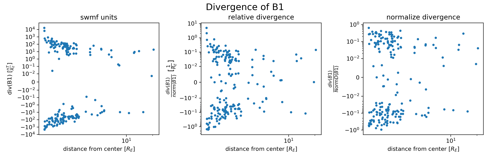
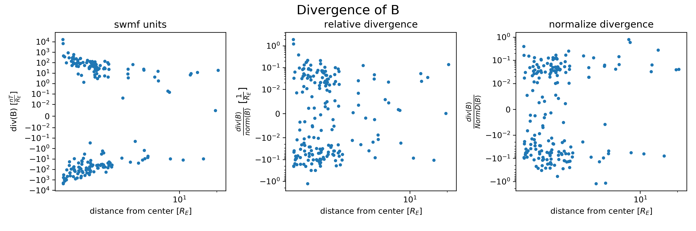

## checking curl of B1
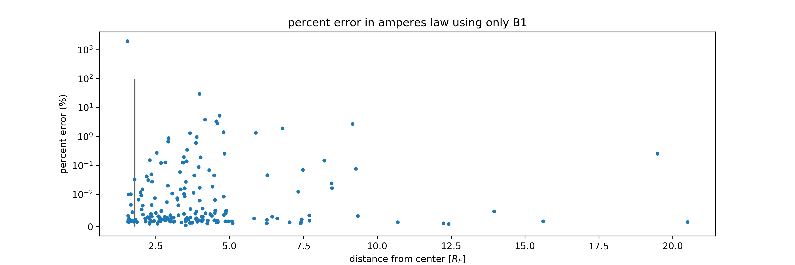
> percent error = $100% * \frac{|curl(B1)-\mu_0 J|}{|\mu_0 J|}$
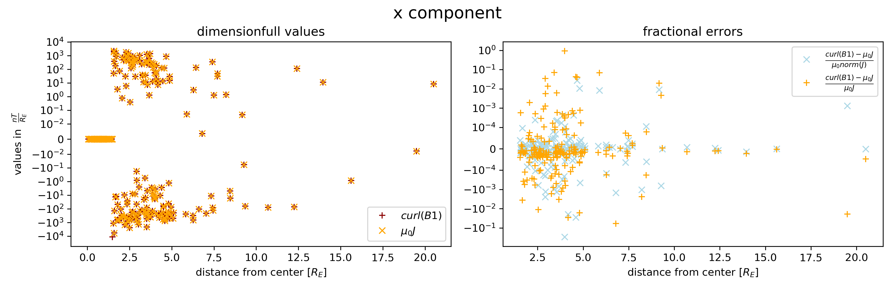
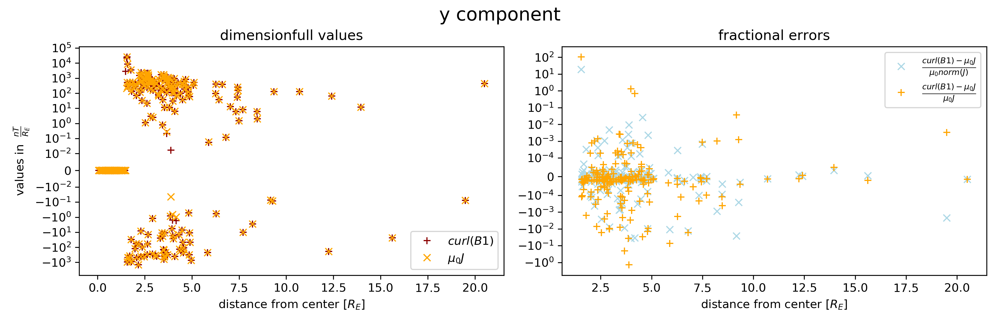
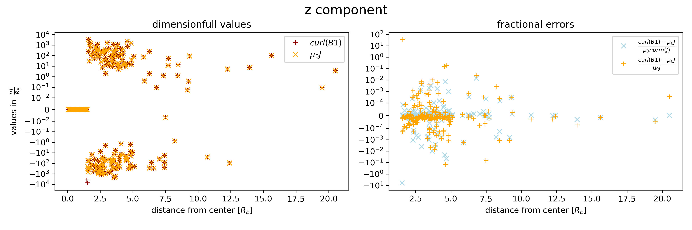

## checking curl of B
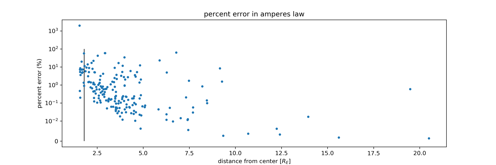
> percent error = $100% * \frac{|curl(B)-\mu_0 J|}{|\mu_0 J|}$
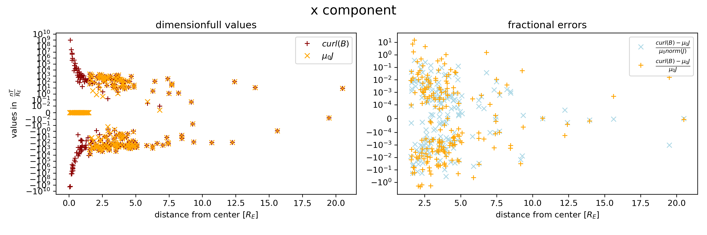
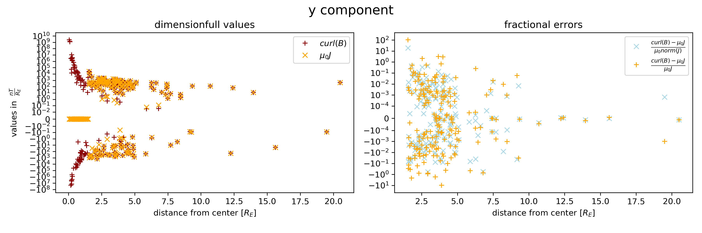
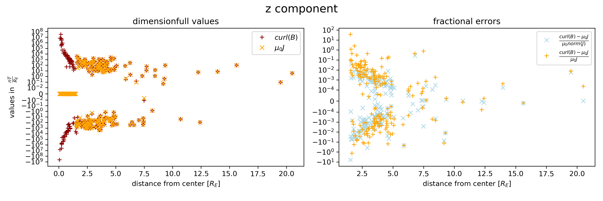
