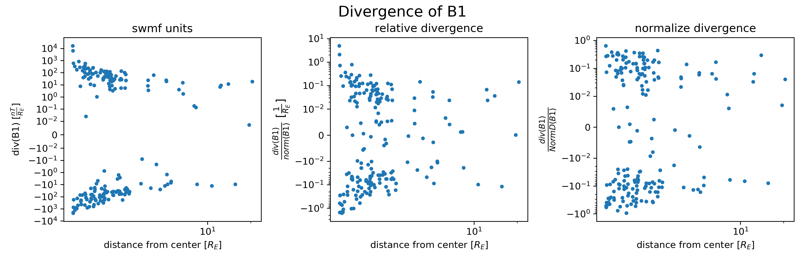
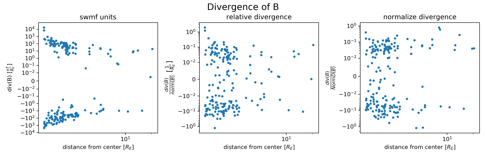
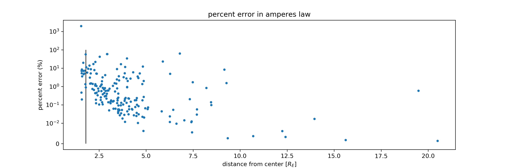

# Introduction

Here we will look at plots from from the DIPTSUR2 swmf simulation run, 
and the LUHMANN1979 simple analytic magnetosphere model.

The DIPTSUR2 run
was run on a block tree grid, with points and values output to a
datafile (eventually converted to vtu).

The LUHMANN1979 is an analytic model from 
which includes a callable function for magnetic field. This function was
then evaluated at each point of the DIPTSUR2 run grid, in order to make
a mock vtu file.

All the plots shown in the next section were done using points sampled from this native block tree grid.

The three swmf variables used here are: "b", "b1", "j". Here "b" represents
the full magnetic field, "b1" represent the magnetic field minus the contribution
from the earths dipole field, and "j" represents the current density.

In the DIPTSUR2 run, "j" is not actually part of the simulation equations. 
Suposedly "j" is calculated as the curl of "b" (multiplied by mu_0) evaluated
on the native block tree grid, using a discrete derivative formula. If this is
this case, then I would expect taking the descrete curl of "b" from the datafile
to exacly reporduce "j".

In the LUHMANN1979 mock run, the magnetic field model includes a dipole term,
and a non dipole term $ bla $. Here "b" was taken to be the full magnetic field and
"b1" the non dipole term, evaluated at the native grid points. Then, the analytic
magnetic field function was analytically differentiated to get the curl.
This analytic curl, multiplied by mu_0, was evalueated at the grid points to get "j".
As a result, taking a descrete derivative aproximation of "b" is **not** 
expected to *exactly* reproduce "j".

# Plots 

first lets look at "b1", which does not include the dipole field and so we
can isolate effects from that. It's divergence should be (close to) 0.

> for luhmann1979, normalized divergence of B1 is almost always well within 10^-2 of the regions

> for diptsur2, normalized divergence of B1 is 

now lets put back the dipole field and look at the divergence of "b".

> for luhmann1979, normalized divergence of B starts at arround 10^-2 then rapidly drops to near zero with distance,
  until

> for diptsur2, normalized divergence of B is 

Now lets look at the error in amperes law.

> the error starts out small at small distances, it gets noticably larger at around 5 Re (expected) but not that large,
> and then it seems to level out for very large distances. The first part is expected because
> 
> I don't know why for large distances there appears to be a sharp line around 10% error. 

