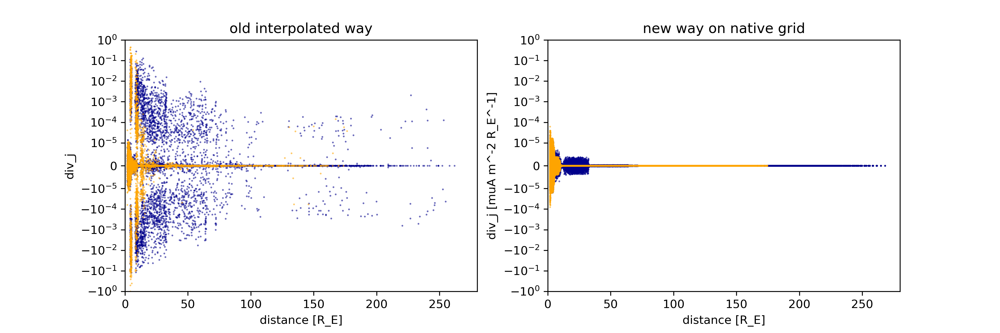
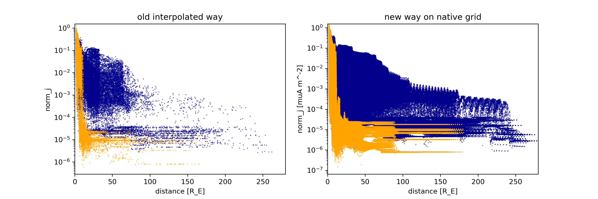
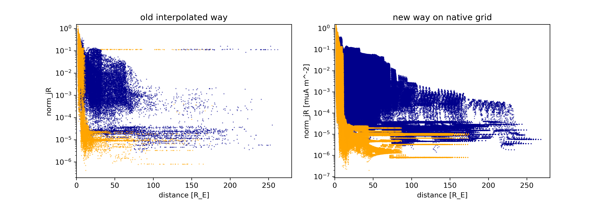
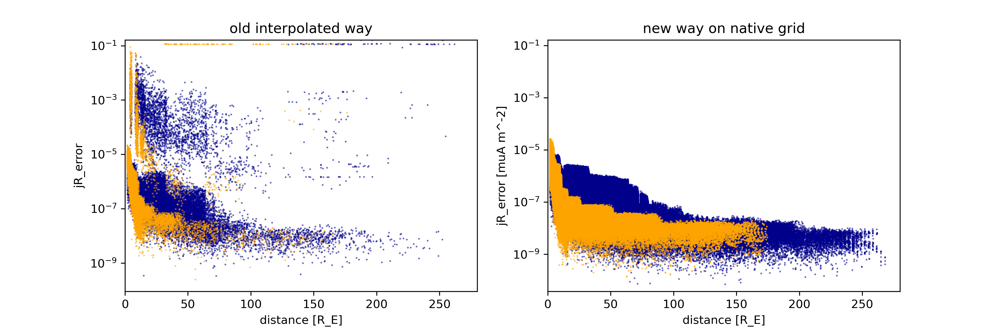

# Intro

These plots are for from the DIPTSUR2 run.
The 'old interpolated way' is using the VTK library interpolation, not Kameleon.

b and b1 are in nanotesla, j in microamperes per meter squared. Divergence uses units of 1/R_E

all points in the native grid are used except those at the edges/boundaries of a block,
and those within 1.8 R_E from earths center.

"jR" here is the attempt to reconstruct "j" from "b1". This is done by 
taking curl_b1, and dividing by mu_0 = 8014.956840
(vacuum permeability in the apropriate units)

In all the plots that follow, the dots are color coded based on
whether the point is on the day side or the night side.
Night side is Blue, Day side is Orange.

## divergence of b1

## divergence of b

## divergence of j

## norm (magnitude) of j

## norm (magnitude) of jR

## error in jR

> this is the norm (magnitude) of the vector difference between jR and j,
> and thus is still in microamperes per meter squared.
