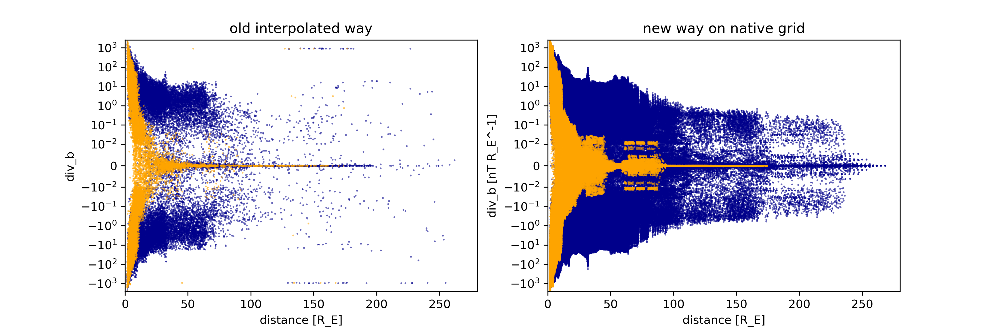

# Intro

These plots are for from the DIPTSUR2 run.
The 'old interpolated way' is using the VTK library interpolation, not Kameleon.

b and b1 are in nanotesla, j in microamperes per meter squared. Divergence uses units of 1/R_E

## divergence B1

## divergence B

## divergence J

